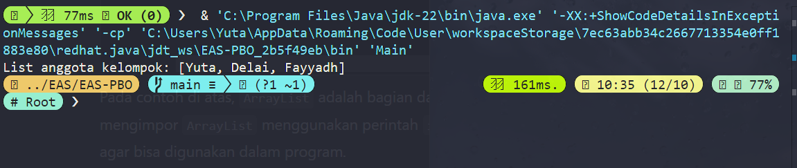

# **EAS-PBO**

**Nama** : Adyuta Prajahita Murdianto

**NRP** : 5025221186

**Kelas** : PBO A


## **Problems**

1. Apa yang dimaksud dengan Package Library dalam Java. Jelaskan kegunaan dan contoh penggunaannya dalam pemrograman.

2. Buatlah Rancangan Aplikasi yang diambil dalam Final Project.

3. Deskripsikan kegunaan dan ruang lingkup aplikasi.

4. Implementasikan Aplikasi yang telah didesain dengan menggunakan Pemrograman Berbasis Obyek Java.

5. Buat PPT presentasi yang menunjang Demo Aplikasi.

6. Demokan aplikasi dengan membuat video dan diupload di Youtube.

## **No. 1**

`Package` pada java adalah pengelompokan `kelas`, `interface`, dan bahkan `sub-package` dalam suatu `namespace` atau paket. `Package` sendiri digunakan untuk membungkus `kelas`, `interface` dan `sub-package` yang dapat digunakan lagi pada project lain, sehingga kita tidak perlu membuat terus menerus kode-kode tersebut.

### **Contoh**

```java
import java.util.ArrayList;  

public class Main {
    public static void main(String[] args) {
        ArrayList<String> list = new ArrayList<>();
        
        list.add("Yuta");
        list.add("Delai");
        list.add("Fayyadh");
        
        System.out.println("List anggota kelompok: " + list);
    }
}
```



Pada contoh program diatas kita menggunakan package `java.util.ArrayList` yang memiliki kelas `ArrayList` yang merupakan implementasi dari `ArrayList`. Dengan menggunakan package diatas, kita tidak perlu susah-susah membuat lagi kode untuk implementasi `ArrayList` nya, cukup membuat objek baru dari kelas `ArrayList` yang terkandung dalam package tersebut. 