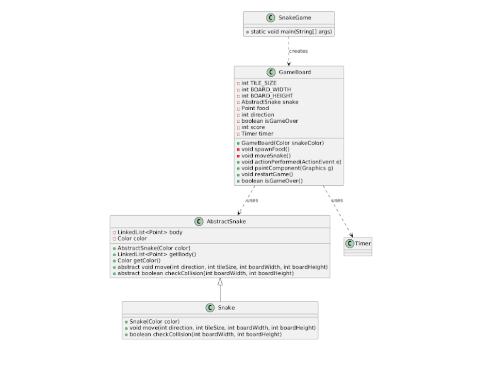

# **EAS-PBO**

**Nama** : Adyuta Prajahita Murdianto

**NRP** : 5025221186

**Kelas** : PBO A


## **Problems**

1. Apa yang dimaksud dengan Package Library dalam Java. Jelaskan kegunaan dan contoh penggunaannya dalam pemrograman.

2. Buatlah Rancangan Aplikasi yang diambil dalam Final Project.

3. Deskripsikan kegunaan dan ruang lingkup aplikasi.

4. Implementasikan Aplikasi yang telah didesain dengan menggunakan Pemrograman Berbasis Obyek Java.

5. Buat PPT presentasi yang menunjang Demo Aplikasi.

6. Demokan aplikasi dengan membuat video dan diupload di Youtube.

## **No. 1**

`Package` pada java adalah pengelompokan `kelas`, `interface`, dan bahkan `sub-package` dalam suatu `namespace` atau paket. `Package` sendiri digunakan untuk membungkus `kelas`, `interface` dan `sub-package` yang dapat digunakan lagi pada project lain, sehingga kita tidak perlu membuat terus menerus kode-kode tersebut.

### **Contoh**

```java
import java.util.ArrayList;  

public class Main {
    public static void main(String[] args) {
        ArrayList<String> list = new ArrayList<>();
        
        list.add("Yuta");
        list.add("Delai");
        list.add("Fayyadh");
        
        System.out.println("List anggota kelompok: " + list);
    }
}
```


Pada contoh program diatas kita menggunakan package `java.util.ArrayList` yang memiliki kelas `ArrayList` yang merupakan implementasi dari `ArrayList`. Dengan menggunakan package diatas, kita tidak perlu susah-susah membuat lagi kode untuk implementasi `ArrayList` nya, cukup membuat objek baru dari kelas `ArrayList` yang terkandung dalam package tersebut. 

## **No. 2**



### **Class AbstractSnaake**

```java
import java.awt.*;
import java.util.LinkedList;

public abstract class AbstractSnake {
    protected LinkedList<Point> body;
    protected Color color;

    public AbstractSnake(Color color) {
        this.color = color;
        body = new LinkedList<>();
        body.add(new Point(100, 100));
    }

    public LinkedList<Point> getBody() {
        return body;
    }

    public Color getColor() {
        return color;
    }

    public abstract void move(int direction, int tileSize, int boardWidth, int boardHeight);

    public abstract boolean checkCollision(int boardWidth, int boardHeight);
}
```

Kelas ini dirancang sebagai template untuk implementasi kelas `Snake` yang merepresentasikan ular dalam game.

**1. Atribut**

`protected LinkedList<Point> body`

- Tipe: LinkedList<Point>
- Fungsi: Menyimpan koordinat (x, y) yang merepresentasikan bagian-bagian tubuh ular di papan permainan.
- LinkedList cocok digunakan karena:
- Mendukung operasi penambahan atau penghapusan elemen di awal/akhir daftar (sering dilakukan dalam permainan ular).
- Mempermudah pengelolaan kepala dan ekor ular.

`protected Color color`

- Tipe: Color (dari paket java.awt)
- Fungsi: Menyimpan warna ular, yang ditentukan ketika ular dibuat.

**2. Kontruktor**

- Parameter:

  - Color color: Warna ular yang akan digunakan.

- Tugas:

  - Menginisialisasi atribut color dengan warna yang diberikan.
  - Membuat LinkedList kosong untuk tubuh ular.
  - Menambahkan satu titik awal (di koordinat (100, 100)) sebagai kepala ular.

**3. Metode**

`public LinkedList<Point> getBody()`

- Mengembalikan referensi ke body (daftar yang menyimpan posisi tubuh ular).
- Metode ini memungkinkan kelas lain untuk mengakses posisi tubuh ular.

`public Color getColor()`

- Mengembalikan nilai atribut color (warna ular).

`public abstract void move(int direction, int tileSize, int boardWidth, int boardHeight)`

- Abstract Method: Harus diimplementasikan oleh subclass.
- Tugas: Mengatur logika pergerakan ular berdasarkan:
- direction: Arah gerakan (0 = atas, 1 = kanan, 2 = bawah, 3 = kiri).
- tileSize: Ukuran satu petak di papan permainan.
- boardWidth dan boardHeight: Dimensi papan permainan untuk memastikan ular tidak keluar dari batas.

`public abstract boolean checkCollision(int boardWidth, int boardHeight)`

- Abstract Method: Harus diimplementasikan oleh subclass.
- Tugas: Memeriksa apakah ular mengalami tabrakan:
    - Dengan dinding papan permainan.
    - Dengan tubuhnya sendiri.

### **Class GameBoard**

```java
import javax.swing.*;
import java.awt.*;
import java.awt.event.ActionEvent;
import java.awt.event.ActionListener;
import java.awt.event.KeyAdapter;
import java.awt.event.KeyEvent;
import java.util.Random;

public class GameBoard extends JPanel implements ActionListener {
    private final int TILE_SIZE = 20;
    private final int BOARD_WIDTH = 800;
    private final int BOARD_HEIGHT = 600;

    private AbstractSnake snake;
    private Point food;
    private int direction;
    private boolean isGameOver;

    private int score;

    private Timer timer;

    public GameBoard(Color snakeColor) {
        setPreferredSize(new Dimension(BOARD_WIDTH, BOARD_HEIGHT));
        setBackground(Color.BLACK);
        setFocusable(true);

        snake = new Snake(snakeColor);
        direction = 1;

        spawnFood();

        score = 0;

        timer = new Timer(100, this);
        timer.start();

        addKeyListener(new KeyAdapter() {
            @Override
            public void keyPressed(KeyEvent e) {
                if (!isGameOver) {
                    switch (e.getKeyCode()) {
                        case KeyEvent.VK_UP:
                            if (direction != 2)
                                direction = 0;
                            break;
                        case KeyEvent.VK_RIGHT:
                            if (direction != 3)
                                direction = 1;
                            break;
                        case KeyEvent.VK_DOWN:
                            if (direction != 0)
                                direction = 2;
                            break;
                        case KeyEvent.VK_LEFT:
                            if (direction != 1)
                                direction = 3;
                            break;
                    }
                }
            }
        });
    }

    private void spawnFood() {
        Random rand = new Random();
        int x = rand.nextInt(BOARD_WIDTH / TILE_SIZE) * TILE_SIZE;
        int y = rand.nextInt(BOARD_HEIGHT / TILE_SIZE) * TILE_SIZE;
        food = new Point(x, y);
    }

    private void moveSnake() {
        snake.move(direction, TILE_SIZE, BOARD_WIDTH, BOARD_HEIGHT);
        Point head = snake.getBody().getFirst();

        if (head.equals(food)) {
            spawnFood();
            score += 1;
        } else {
            snake.getBody().removeLast();
        }

        if (snake.checkCollision(BOARD_WIDTH, BOARD_HEIGHT)) {
            isGameOver = true;
        }
    }

    @Override
    public void actionPerformed(ActionEvent e) {
        if (!isGameOver) {
            moveSnake();
        }
        repaint();
    }

    @Override
    protected void paintComponent(Graphics g) {
        super.paintComponent(g);

        if (isGameOver) {
            String message = "Game Over! Press R to restart.";
            g.setColor(Color.WHITE);
            g.drawString(message, BOARD_WIDTH / 2 - g.getFontMetrics().stringWidth(message) / 2, BOARD_HEIGHT / 2);
            return;
        }

        g.setColor(snake.getColor());
        for (Point p : snake.getBody()) {
            g.fillRect(p.x, p.y, TILE_SIZE, TILE_SIZE);
        }

        g.setColor(Color.RED);
        g.fillRect(food.x, food.y, TILE_SIZE, TILE_SIZE);

        g.setColor(Color.WHITE);
        g.drawString("Score: " + score, 10, 20);
    }

    public void restartGame() {
        snake = new Snake(snake.getColor());
        direction = 1;
        spawnFood();
        score = 0;
        isGameOver = false;
        timer.restart();
    }

    public boolean isGameOver() {
        return isGameOver;
    }
}
```

Implementasi kelas GameBoard, yang mengatur logika utama permainan ular menggunakan `GUI` berbasis `Swing`.

**1. Atribut**

`TILE_SIZE`

- Ukuran satu petak pada papan permainan (20 piksel).
  
`BOARD_WIDTH, BOARD_HEIGHT`

- Dimensi papan permainan (800x600 piksel).

`AbstractSnake snake`

- Representasi ular dalam permainan, diimplementasikan menggunakan kelas turunan Snake.

`Point food`

- Posisi makanan pada papan permainan.

`int direction`

- Arah gerakan ular (0 = atas, 1 = kanan, 2 = bawah, 3 = kiri).

`boolean isGameOver`

- Status permainan (apakah permainan sudah selesai).

`int score`

- Skor pemain.

`Timer timer`

- Mengatur interval waktu untuk memindahkan ular dan memperbarui layar.

**2. Kontruktor**

- Tugas:

  - Menentukan ukuran dan latar belakang papan permainan.
  - Membuat objek ular dengan warna yang dipilih.
  - Menginisialisasi arah gerakan (direction) ke kanan.
  - Memanggil metode spawnFood() untuk menghasilkan posisi awal makanan.
  - Mengatur skor awal menjadi 0.
  - Membuat dan memulai Timer untuk mengatur pergerakan ular.
  - Menambahkan pendengar keyboard (KeyAdapter) untuk mengatur arah gerakan ular.

- KeyAdapter:

  - Mengatur perubahan arah berdasarkan input keyboard:

    - Aturan: Arah baru tidak boleh berlawanan dengan arah saat ini (misalnya, dari atas langsung ke bawah tidak diperbolehkan).

**3. Metode**

`spawnFood()`

- Menghasilkan posisi acak untuk makanan.
- Koordinat makanan selalu kelipatan dari TILE_SIZE agar sejajar dengan grid papan.

`moveSnake()`

- Memindahkan ular berdasarkan arah saat ini.
- Memeriksa:
    - Apakah kepala ular memakan makanan: Jika iya, makanan baru dihasilkan dan skor bertambah.
    - Apakah ular bertabrakan: Jika iya, permainan berakhir.

`actionPerformed(ActionEvent e)`

- Dipanggil otomatis oleh Timer pada interval tertentu.
- Memanggil moveSnake() jika permainan belum berakhir.
- Memanggil repaint() untuk memperbarui tampilan papan permainan.

`paintComponent(Graphics g)`

- Bertanggung jawab menggambar elemen permainan.
- Jika permainan selesai, menampilkan pesan "Game Over!".
- Jika belum selesai:
  - Menggambar ular (warna ditentukan).
  - Menggambar makanan (warna merah).
  - Menampilkan skor pemain.

`restartGame()`

- Mengatur ulang status permainan:
  - Membuat ular baru.
  - Mengatur ulang arah gerakan, skor, dan status permainan.
  - Memulai ulang Timer.

`isGameOver()`

- Mengembalikan status permainan.

### **Class Snake**

```java
import java.awt.*;

public class Snake extends AbstractSnake {
  public Snake(Color color) {
    super(color);
  }

  @Override
  public void move(int direction, int tileSize, int boardWidth, int boardHeight) {
    Point head = body.getFirst();
    Point newHead = null;

    switch (direction) {
      case 0:
        newHead = new Point(head.x, head.y - tileSize);
        break;
      case 1:
        newHead = new Point(head.x + tileSize, head.y);
        break;
      case 2:
        newHead = new Point(head.x, head.y + tileSize);
        break;
      case 3:
        newHead = new Point(head.x - tileSize, head.y);
        break;
    }

    body.addFirst(newHead);
  }

  @Override
  public boolean checkCollision(int boardWidth, int boardHeight) {
    Point head = body.getFirst();
    return head.x < 0 || head.y < 0 || head.x >= boardWidth || head.y >= boardHeight
        || body.subList(1, body.size()).contains(head);
  }
}
```

Implementasi kelas konkret `Snake` yang merupakan turunan dari kelas abstrak `AbstractSnake`. Kelas ini mengatur logika spesifik untuk gerakan ular dan mendeteksi tabrakan dalam permainan ular.

**1. Atribut**

Pada kelas ini tidak terdapat atribut tertentu, sehingga hanya mengikuti atribut dari abstract class nya saja.

**2. Konstruktor**

- Memanggil konstruktor kelas abstrak AbstractSnake untuk menginisialisasi:

  - Warna ular (color).
  - Posisi awal tubuh ular (dimulai dari (100, 100)).
  
- Parameter:

  - Color color: Warna yang akan diberikan pada ular.

**3. Metode**

`move`

- Fungsi: Menggerakkan ular sesuai arah saat ini.
  
- Parameter:
  
  - direction: Arah gerakan (0 = atas, 1 = kanan, 2 = bawah, 3 = kiri).
  - tileSize: Ukuran langkah ular (besar satu petak dalam piksel).
  - boardWidth, boardHeight: Dimensi papan permainan.
  
- Logika:
  
  - Mendapatkan koordinat kepala ular saat ini (head).
  - Menghitung posisi kepala baru (newHead) berdasarkan arah (direction):
    - 0: Mengurangi koordinat y untuk bergerak ke atas.
    - 1: Menambah koordinat x untuk bergerak ke kanan.
    - 2: Menambah koordinat y untuk bergerak ke bawah.
    - 3: Mengurangi koordinat x untuk bergerak ke kiri.
  - Menambahkan titik baru (newHead) ke awal tubuh ular (body.addFirst(newHead)), sehingga kepala ular pindah ke posisi baru.

`checkCollision`

- Fungsi: Memeriksa apakah ular mengalami tabrakan.

- Parameter:

  - boardWidth, boardHeight: Dimensi papan permainan.

- Logika:

  - Tabrakan dengan Dinding:
    - Jika koordinat kepala (head) kurang dari 0 atau lebih besar/equal dari dimensi papan (boardWidth atau boardHeight), dianggap keluar batas.
  - Tabrakan dengan Tubuh Sendiri:
    - Memeriksa apakah kepala (head) ada dalam bagian tubuh lain (body.subList(1, body.size())).
  - Jika salah satu kondisi terpenuhi, metode mengembalikan true (ular bertabrakan).

### **Class SnakeGame**

```java
import javax.swing.*;
import java.awt.*;

public class SnakeGame {
  public static void main(String[] args) {
    Color selectedColor = JColorChooser.showDialog(null, "Pilih Warna Snake", Color.GREEN);
    if (selectedColor == null) {
      selectedColor = Color.GREEN;
    }

    JFrame frame = new JFrame("Snake Game");
    GameBoard gameBoard = new GameBoard(selectedColor);

    frame.setDefaultCloseOperation(JFrame.EXIT_ON_CLOSE);
    frame.add(gameBoard);
    frame.pack();
    frame.setVisible(true);

    gameBoard.addKeyListener(new java.awt.event.KeyAdapter() {
      @Override
      public void keyPressed(java.awt.event.KeyEvent e) {
        if (e.getKeyCode() == java.awt.event.KeyEvent.VK_R && gameBoard.isGameOver()) {
          gameBoard.restartGame();
        }
      }
    });
  }
}
```

Implementasi kelas utama (`SnakeGame`) yang menginisialisasi permainan ular.

**2. Metode**

`main`

- Fungsi: Titik masuk (entry point) dari program untuk menjalankan permainan ular.
  
- Langkah-langkah Utama:

  1. Pemilihan Warna Ular:

       ```java
       Color selectedColor = JColorChooser.showDialog(null, "Pilih Warna Snake", Color.GREEN);
       if (selectedColor == null) {
         selectedColor = Color.GREEN;
       }
       ``` 

       - Membuka dialog pemilihan warna (JColorChooser).
       - Jika pengguna tidak memilih warna, warna default (Color.GREEN) digunakan. 
  
  2. Membuat dan Menampilkan JFrame:

       ```java
       JFrame frame = new JFrame("Snake Game");
       GameBoard gameBoard = new GameBoard(selectedColor);
       ``` 

       - Membuat jendela utama (JFrame) dengan judul "Snake Game".
       - Membuat objek GameBoard dengan warna ular yang dipilih.
       - Menambahkan GameBoard ke dalam JFrame.
  
  3. Pengaturan JFrame:

       ```java
       frame.setDefaultCloseOperation(JFrame.EXIT_ON_CLOSE);
       frame.add(gameBoard);
       frame.pack();
       frame.setVisible(true);
       ``` 

       - setDefaultCloseOperation: Menutup aplikasi saat jendela ditutup.
       - add: Menambahkan papan permainan (GameBoard) ke jendela.
       - pack: Mengatur ukuran jendela agar sesuai dengan konten (yaitu ukuran papan permainan).
       - setVisible(true): Menampilkan jendela ke layar.

  4. Menambahkan KeyListener untuk Restart:

       ```java
       gameBoard.addKeyListener(new java.awt.event.KeyAdapter() {
         @Override
         public void keyPressed(java.awt.event.KeyEvent e) {
           if (e.getKeyCode() == java.awt.event.KeyEvent.VK_R && gameBoard.isGameOver()) {
             gameBoard.restartGame();
           }
         }
       });
       ``` 
   
      - Fungsi: Menangkap tombol yang ditekan saat permainan berlangsung.
      - Logika:
  
        Jika tombol R ditekan dan permainan berakhir, metode restartGame() pada GameBoard dipanggil untuk memulai ulang permainan.

## **No. 3**

### **Deskripsi Kegunaan Aplikasi**

Aplikasi Snake Game adalah permainan klasik yang dirancang untuk hiburan. Pemain mengendalikan seekor ular yang bergerak di dalam sebuah papan permainan, dengan tujuan utama adalah memakan makanan (dalam bentuk titik merah) untuk meningkatkan skor. Setiap kali ular memakan makanan, panjang tubuhnya bertambah, sehingga membuat permainan semakin menantang.

### **Fitur Utama:**

  - Interaksi dengan Keyboard: Pemain dapat mengendalikan arah gerak ular menggunakan tombol panah.
  - Penentuan Warna Ular: Pemain dapat memilih warna ular sebelum permainan dimulai.
  - Restart Permainan: Jika pemain kalah (game over), permainan dapat dimulai ulang dengan menekan tombol R.
  - Penampilan Skor: Skor pemain ditampilkan secara real-time di papan permainan.

### **Ruang Lingkup Aplikasi**

**1. Target Pengguna:**

- Siapa saja yang mencari hiburan sederhana di perangkat berbasis Java.
- Cocok untuk semua usia, terutama pengguna yang menyukai permainan retro dan berbasis refleks.

**2. Konteks Penggunaan:**

- Hiburan Ringan: Aplikasi ini dirancang untuk dimainkan secara kasual.
- Pengenalan Pemrograman GUI: Game ini juga dapat digunakan sebagai proyek awal bagi programmer yang belajar pengembangan GUI di Java.
- Latihan Refleks dan Koordinasi: Karena mengandalkan kecepatan reaksi dan koordinasi mata-tangan.

**3. Lingkup Teknis:**

- Teknologi yang Digunakan:
  - Java Swing: Untuk antarmuka grafis dan elemen interaktif seperti papan permainan.
  - Timer: Untuk memastikan ular bergerak dengan interval waktu tetap.
  - JColorChooser: Memberikan kemampuan kepada pengguna untuk memilih warna ular secara dinamis.
- Keterbatasan:
  - Tidak mendukung fitur seperti penyimpanan skor, variasi tingkat kesulitan, atau mode multi-pemain.
  - Game hanya berjalan pada platform yang mendukung runtime Java.

**4. Potensi Pengembangan:**

- Peningkatan Fitur:
  - Menambahkan berbagai tingkat kesulitan (kecepatan ular yang lebih tinggi, ukuran papan yang lebih kecil).
  - Menyimpan skor tertinggi (high score) di perangkat pengguna.
  - Memberikan rintangan di papan permainan untuk menambah tantangan.
- Portabilitas:
  - Mengonversi aplikasi menjadi aplikasi seluler menggunakan teknologi lintas-platform (misalnya, Kotlin untuk Android).
- Mode Multiplayer:
  - Mengintegrasikan mode di mana dua pemain dapat bermain pada papan permainan yang sama.

## **No. 4**

Terdapat pada direktori `SnakeGame` pada repository ini.

## **No. 5**

Link PPT: 

[https://www.canva.com/design/DAGY3sizWl4/raNb4ZC1sZ29jG2i6PcVkw/edit?utm_content=DAGY3sizWl4&utm_campaign=designshare&utm_medium=link2&utm_source=sharebutton](https://www.canva.com/design/DAGY3sizWl4/raNb4ZC1sZ29jG2i6PcVkw/edit?utm_content=DAGY3sizWl4&utm_campaign=designshare&utm_medium=link2&utm_source=sharebutton)

## **No. 6**

Link Youtube: 

